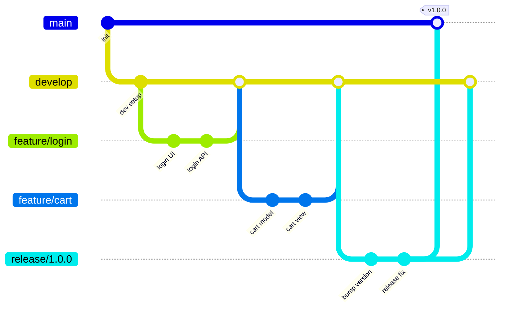
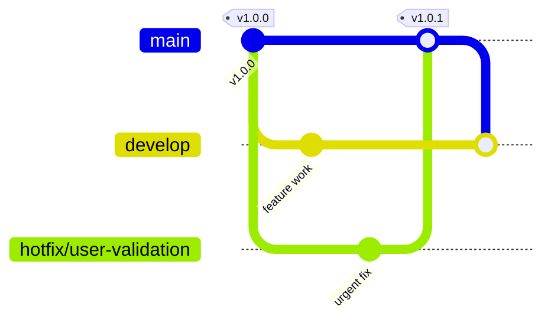

# Git workflow

## Active Branches

Our git workflow consists of 4 types of branches:

- **main**: holds the productive code. Every commit here is a released, deployable state or a hotfix.

- **develop** – the integration branch where finished features are merged and tested together.

- **feature** – short-lived branches for developing individual contributions. They branch off `develop` and merge back into `develop`.

- **release** – branches for promoting the integrated code from `develop` to production. They branch off `develop`, get final fixes, then merge into both `main` and `develop`.

- **hotfix** – short-lived branches for urgent production fixes. They branch off `main`, then merge back into `main` (and are backported to `develop`, same as `release/*` — see [Backports](#backports)).

## Branch flow

1. **Start from `develop`.** All day-to-day work begins by branching a `feature/*` branch off `develop`.
2. **Develop in isolation.** Each contribution lives in its own `feature` branch until it is complete and reviewed.
3. **Integrate into `develop`.** When a feature is done, it merges back into `develop`, where features are combined and tested together. This should be done through a Pull Request.
4. **Cut a `release` branch.** When `develop` is ready to ship, branch a `release/*` branch off it. Only stabilization work (version bumps, bug fixes, docs) happens here — no new features.
5. **Ship to production.** The `release` branch merges into `main` and is tagged with the version number. `main` always reflects what is in production.
6. **Merge back to `develop`.** The `release` branch also merges back into `develop` so any last-minute fixes are not lost.

## Naming conventions

| Branch type | Pattern                | Example              |
| ----------- | -----------------------| -------------------- |
| main        | `main`             | `main`               |
| develop     | `develop`          | `develop`            |
| feature     | `feature/<issue-number>-<name>`   | `feature/login`      |
| release     | `release/<version>`| `release/1.0.0`      |
| hotfix|     | `hotfix/<fix-name>`| `hotfix/user-validation` |

## Hot fixes

Hot fixes are branches with the prefix `hotfix/`. Branch protection on `main` requires every change to go through a merged pull request — there is no direct-push path, even for hotfixes.

### What is a hot fix

Hot fixes are 1-2 lines of code that solve a productive code issue. Previously tested locally with code that is up to date with main.

- Fixes a problem that needs urgent solving.
- Commonly solves problems undetected in a release stage and development environments. Some problems might appear due to configuration issues that are different in production vs staging environments. These are usually "silent" errors.
- The leader of the team is informed of the hotfix and agrees with it.

### What is not a hot fix

❌ Errors that can wait.

❌ Solutions that have multiple lines of code.

❌ Changes not approved by peers.

### Backports

Automated via `.github/workflows/backport.yml`. When a PR from a `hotfix/*` **or** `release/*` branch merges into `main`, the workflow automatically opens (or updates) a `main` → `develop` pull request so the two branches stay in sync — no manual `backport/*` branch needed, and nothing to do by hand unless the auto-opened PR has conflicts (see the PR body it generates for how to resolve those locally).

If `develop` already contains everything on `main` (e.g. the release branch was cut straight off `develop`'s tip), the workflow detects that and skips opening a PR.

Merge these auto-opened PRs with a **merge commit**, not squash — squashing would make `develop` look permanently behind `main`, and the workflow would reopen the same PR on the next hotfix/release.

The hotfix (or release) branch merges into `main` and is tagged with a new version. The backport workflow then opens a `main` → `develop` PR directly — merging it brings `develop` up to date with the same commits.

## Releases

Releases should follow an ascending order, using [**Semantic Versioning**](https://semver.org/):

Major.minor.fix

### Versioning

Versions should be tagged in GitHub and endorsed by a `CHANGELOG.md` file. `CHANGELOG.md` is maintained by hand (no CI auto-generates it) — add the `## [x.y.z] - YYYY-MM-DD` header as part of the release/hotfix PR.

## Pull requests

- [Use conventional commits for comments](https://www.conventionalcommits.org/en/v1.0.0/).
- Request at least 2 reviews.
- Merge method is enforced per branch by repo rulesets, not left to preference: PRs into `main` require a **merge commit** (squash is disabled); PRs into `develop` require **squash**.
